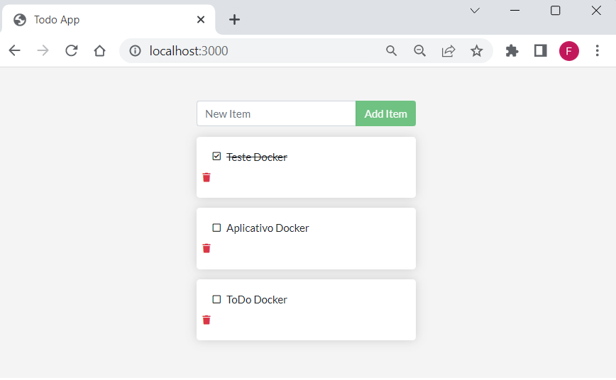

# Exemplo Docker App

Exemplo de aplicação Docker File

Executar o Docker Desktop na máquina

Docker Hub: https://hub.docker.com/

# Comandos 

> 
Cria a imagem como o nome "app" 

* 
docker build -t app:v1 .

> 
Sobe o container "app" 

* docker run -dp 3000:3000 app
> 
Visualiza imagens

* 
docker images

>  
Login no Docker Hub

* 
docket login

>  
Publica no Docker Hub

* 
docker push fernandazaccarorigolin/app:v1

# Imagem do aplicativo de exemplo

